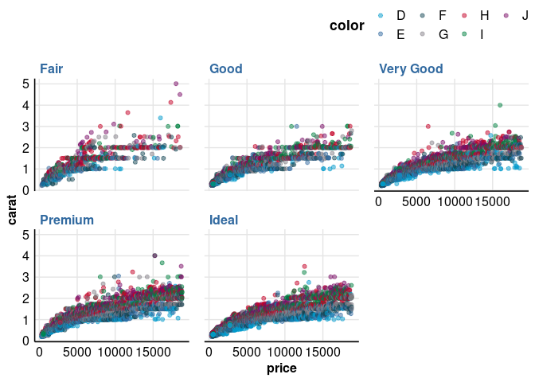

<!-- README.md is generated from README.Rmd. Please edit that file -->

# covalencer

<!-- badges: start -->
<!-- badges: end -->

covalencer contains various R functions in use at Covalence Research for
health economic modeling, literature synthesis, medical communication,
or just plain old data wrangling. Perhaps most notably, it provides
access to the Covalence ggplot theme and associated color palettes.

## How to install

You can install the development version of covalencer from
[GitHub](https://github.com/) with:

``` r
# install.packages("pak")
pak::pkg_install("CovalenceResearch/covalencer")
```

## How to use

### ggplot theme

Apply `theme_covalence()`to an existing `ggplot` object, like any other
theme.

``` r
library(ggplot2)
library(covalencer)

ggplot(data = diamonds, aes(x = price, y = carat)) +
    geom_point() +
    facet_wrap(vars(cut)) +
    theme_covalence()
```


